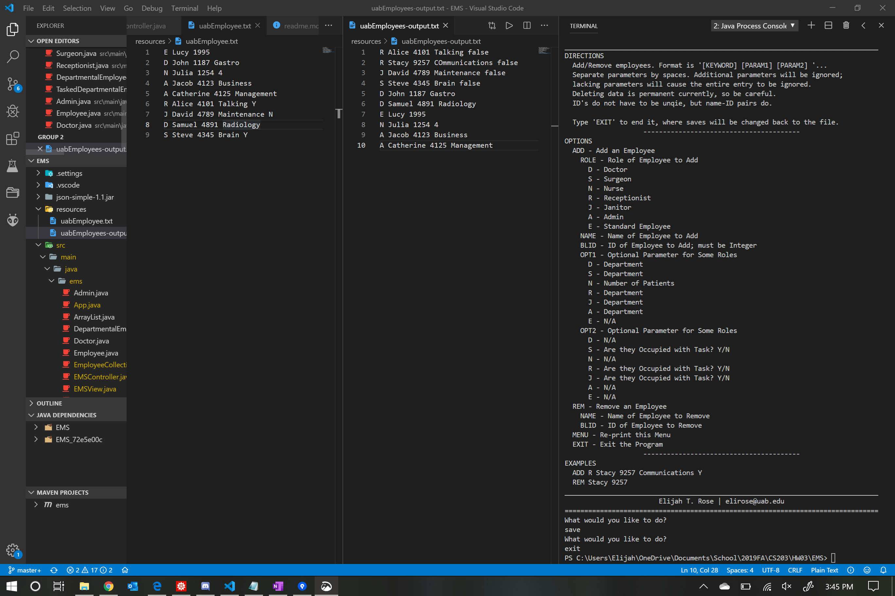

# EMS: Employee Management System

## Assignment
The goal of this assignment is to create a hospital employee tracking system for the UAB hospitals. You will create a Java project to automate the adding, deleting and displaying the list of UAB hospital employees. The set of classes define these employees of a hospital; hospital employee, doctor, nurse, administrator, surgeon, receptionist, and janitor. Your code initially will read a list from txt file (uabEmployee.txt) create the corresponding objects. You will store the objects in java arrays and when you terminate the program you will save the updated list of the employees into same txt file.

* You must use inheritance in creating those classes (Penalty = 20 points) 
* You can use arrays to store objects of the same Class, you can assume maximum size = 10 or one array to store all objects of all the Classes, you can assume maximum size = 50. 
* When you start the program, you will read the [`uabEmployee.txt`](resources/uabEmployee.txt) file line by line. Each line will be containing information for one specific object. You will create these objects and store them in your object array (program memory) 
* You need to display a menu with the following options:
  * **C**REATE: Add employee
    * Admin|Administrator
    * Doctor
    * Nurse
    * Surgeon
    * Receptionist
    * Janitor
  * **R**EAD: Display the employee list
  * **U**PDATE: Update the database 
  * **D**ELETE:Delete employee based on role and blazerID
* Use the Constructors to automatically initialize the instance variables (they should be all declared as private, Penalty = 20 points) 
* Create the appropriate accessor and mutator methods for each private instance variables (setters/getters) 
* Add (overwrite) the methods to display, use `toString()` method and `super()` for printing the employee list. 
* You will create the necessary attributes and methods for each class (check the sample input and output to decide the methods and attributes).

## Example IO
`sampleUabEmplyee.txt`:
> E Lucy 1995
D John 1187 Gastro
N Julia 1254 4
A Jacob 4123 Business
A Catherine 4125 Management
R Alice 4101 Talking Y
J David 4789 Maintenance N
D Samuel 4891 Radiology
S Steve 4345 Brain Y

Sample Ouput:

> ********************************** Welcome to the UAB Employee System *********************************

> The UAB Hospital System has the following employees: 
 
> Total Number of employees = 9 
 
> Hospital Employees: 1
> Name: Lucy   BlazerId: 1995 
 
> Doctors: 2
> Name: John BlazerId: 1187 Specialty: Gastro 
> Name: Samuel BlazerId: 4891 Specialty: Radiology 
 
> Surgeons: 1 
> Name: Steve BlazerId: 4345 Specialty: Brain Operating: Y 
 
> Nurses: 1 
> Name: Julia BlazerId:1254 Number of Patients: 4 
 
> Administrators: 2 
> Name: Jacob BlazerId: 4123 Department: Business 
> Name: Catherine BlazerId: 4125 Department: Management 
 
> Receptionist: 1 
> Name: Alice BlazerId: 4101 Department: Talking Answering: Y 
 
> Janitors: 1 
> Name: David BlazerId 4789 Department: Maintenance Sweeping: N 
 
> ****************************************************************** 
## Sample Running 

A sample of adding Stacy to the program; note that it is sligghtly modified to go to a special output file instead of original file for demonstration purposes (this is reverted to original decision in the actual product).

## Design Decisions

### Inheritance: Theme or IO Based?
One debate and trouble of OOP is how to branch inheritance. For instance, one could go down the path of thematic inheritance where the surgeon inherits from the doctor, the Nurse, Receptionist, and Janitor deriving from a SupplementaryEmployee class, etc. One could also go down the path of input command inheritance (as demonstrated here). 

This is where cell-based factories and such can come into use, as you can define the employees based on their properties rather than their lineage, so to speak. However, with such a simple model, object orientation works just fine. The latter approach of using the command line arguements to derive inheritance was used, noting the pseudo-abstract `DepartmentalEmployee` and `TaskedDepartmentalEmployee` classes to aide this.

### Nurse
The `Nurse` was a bit different thematically due to their fourth input arguement. As such, though code-wise the `Nurse` is near identical to the other `DepartmentalEmployee` children, but with a different name for the 4th input arguement.

### Data Typing
As a sidenote, strings were used for almost all data types in classes, though conceivably Integers could be used for such thing as the nurse's patient count and perhaps ID. However, to keep things simple and reduce error-types, strings were simply used, as ID's were not expicitly stated to be only of integer types.

### MCV: Model View Contorller
With limited success, a MCV approach was attempted at seperating functionality within the system. It is not perfect and the controller directly outputs to console, violating MCV, but it is still mostly modular and reduces the clutter of the main `App` class.

### HashMaps and ArrayLists Galore
Notably, I used a good bit of `HashMap`s and `ArrayList`s. The ArrayLists, while less efficient than normal `Array`s, allow easy addition and removal of parts. The `HashMap` and `EmployeeCollection` that stores the role `ArrayList`s serve to help organize each of the `ArrayList`s and "simplify" (with limited success) the menu view of the system.

A `HashMap` is also used at another point to store strings in the view; again, this was as a result of wanting to output a header with the count of children *before* the children are listed (and simultaneously do printing while listing the items, which is not necessarily ideal).

### Save on Exit?
One option is to save on exit, and this is very easily implemented by `ec.save("uabEmployees.txt");` under the `case "exit":` option before the `break;`; I chose *not* to do this as the user should specifically request a save by typing `save` such that if they make an error (accidentally delete or add something) they can restart the session with exiting without saving.

## Suggestions
* `.csv` with commas instead of the current space system

## Contributors

| NAME | CONTACT | ROLE |
| - | - | - |
| Elijah T. Rose | elirose@uab.edu | Author, Developer |
| Dr. Unan | unan@uab.edu | Instructor, Client |